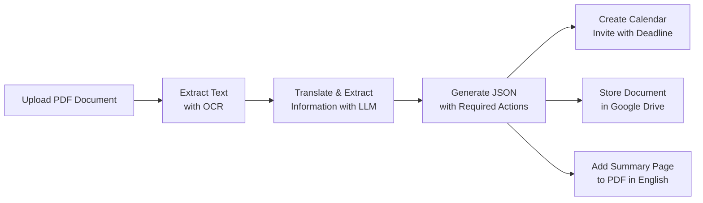

# Stefan AI: Your Personal Document Assistant

## Problem Statement

We are solving the problem of managing and tracking documents in Germany, especially for non-German speakers. This process introduces "Stefan AI" - a personal assistant that helps you manage your government and personal paperwork. Users provide a PDF version of the document, and Stefan AI automatically creates or directs this document to the relevant folder in Google Drive with a convenient summary in English. If the document requires action, it understands it and creates a calendar invite with a deadline and summary for the user to not forget. This is a beta version, and in the future, we plan to introduce the ability to communicate with your files via RAG, allowing users to find and ask questions about their documents.

## Process

1. **PDF Upload and Text Extraction**: 
   - The user journey starts with adding a PDF file. Stefan AI uses OCR (pytesseract) as described in [pdf_text_extractor.py](pdf_text_extractor.py) to retrieve text from the PDF.

2. **Translation and Information Extraction**:
   - The extracted text (in German) is passed to an LLM to translate and extract necessary information. We use the Instructor library, which utilizes Pydantic for structured output with a GPT model. [new_document.py](new_document.py)

3. **User Feedback and Action Creation**:
   - We use the extracted JSON file to render user feedback and create actions, such as creating calendar invites and conveniently storing the files in Google Drive. [google_api.py](google_api.py)

4. **Document Summary and Storage**:
   - Relevant information is added to the calendar invite, and an additional front page in the PDF with a summary in English is created. [pdf_modifier.py](pdf_modifier.py)

## Schema of the Process

## Next Steps

1. **Mobile Application**: 
   - Currently, we are using a simple CLI with Rich, but we envision this to be a mobile application that connects all the dots with scanning the document and the above functionality.

2. **Chatbot Functionality**:
   - We want to add chatbot functionality based on the RAG methodology, allowing users to ask questions about the documents and search for relevant information with metadata.

